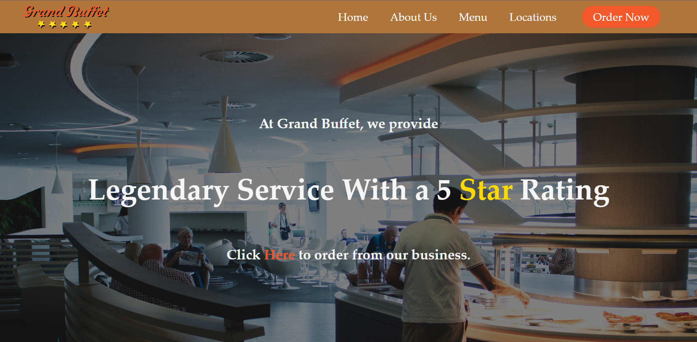
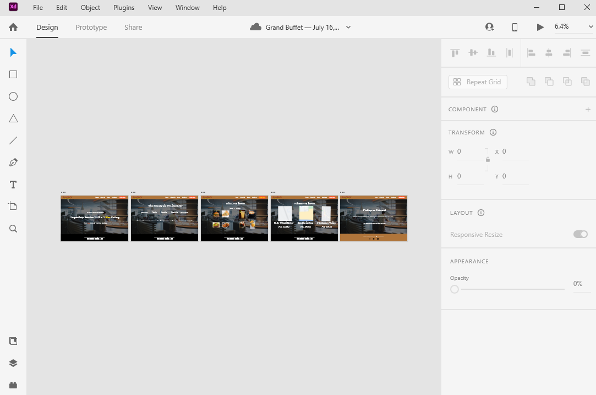

# Mock Restaurant Website: Grandbuffet

## Description
This is a mock restaurant website based on many modern websites that exist on the internet today.
I created the design of the website's logo in Adobe Illustrator and designed the layout in Adobe XD.
It runs as a single-page application without any JavaScript frameworks such as React.js or Vue.js.
This website also functions as a native web application due to Node.js and Express handling all of the client-side routing.
All of the views that are contained in the frontend folder display content using class-based functions.
Content within those files is distributed throughout VS code using JavaScript modules. 

## Conclusion
In the beginning, it was challenging to learn how to reuse Adobe XD. However, I was still able to create a draft that I was satisfied with. 
Before this, I had not used JavaScript modules in my website projects.
Next, I would like to learn how I can apply what I've learned about JavaScript modules to other projects in the future.
Overall, this was a great experience and I'd love to make something similar in the future.

## Credit

Pexels.com - Stock Photos
Adobe XD - Website Draft
Adobe Illustrator - Website Logo
